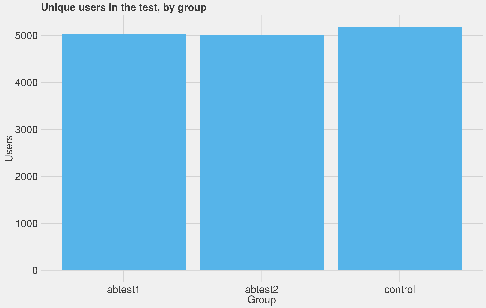

## Summary

This was an A/B test to determine the impact of various UX improvements to the Wikipedia portal (www.wikipedia.org) aimed at increasing the rate at which users click through to our projects. Specifically, we looked at increasing the size of the search box and pairing images and metadata with each search result.

We found evidence that the *combination* of these elements results in a 1-5% higher clickthrough rate - a solid improvement. Absent non-JavaScript support, we recommend the
improvement be deployed.

## Introduction

The default search experience on the Wikipedia portal consists of a small, grey search box.
If something is typed into the box, a plain dropdown of proposed results is given.

We were interested in testing whether increasing the size and prominence of the search box, and distinctly providing descriptions and images for the proposed results, would increase the rate at which users clicked through to a Wikipedia project.

Accordingly we designed an A/B/C test, with three groups. The control group received the default experience. The first test group received a more prominent search bar. The second test group received a more prominent search bar, and in addition images and descriptions in
the results that were returned.

The test ran from 13 January to 20 January 2016, producing 25,579 events from 15,220 browsing sessions. These sessions were almost perfectly evenly distributed between groups:

## Results

What we're studying is improvements with the clickthrough rate, but specifically improvements in the clickthrough rate *via various methods*. We might see:

1. The clickthrough rate increases, because the search box is better;
2. The clickthrough rate increases, but not through the search box - the box is just drawing peoples' attention and making them stay on the page;
3. The clickthrough rate does not increase, but the search box is providing a better user experience - it's just cannibalising clickthroughs from other page elements.

To allow us to distinguish between these outcomes we tested the overall population, the overall population excluding sessions involving clickthroughs via search, and the overall population excluding sessions involving non-search clickthroughs.

### Overall

Applying bayesian methodologies, we compared the first test group to the control, and then the second test group to the control.

With the first test group we found no trustworthy improvement; the difference for the test group as between *-0.9*% and *2.8*%. Since it isn't even consistently positive, it is not reliable.

With the second test group, *1.7* to *5.5*% more sessions were likely to end in a clickthrough compared to the control. This is a tangible improvement.

### Search-related clickthroughs
Looking at search-related clickthroughs, we see (for the first test) a *-1.1%* to *2.77%* change; again, not consistently positive, and thus not a valuable improvement.

The second test, however, shows a *1.88%* to *5.88%* increase in the probability that a user clicks through - again, a marked improvement over the default. The fact that this is a larger increase than the dataset overall suggests strongly that the improvement is coming from an increased use of the search box, rather than cannibalisation or the increased use of non-search elements.

### Non-search-related clickthroughs
If we exclude sessions with search-based clickthroughs from consideration, we end up with both tests performing badly. As with search-related clickthroughs, this strongly suggests that the improvement is due to genuine improvement, rather than a form of cannibalisation or increasing idling time.

## Conclusion

The second A/B test shows a measurable and significant positive effect from the combination of the prominent search box and the additional metadata and images. We believe that, once we have dealt with concerns about how it would perform on non-JavaScript systems (and the commonality of those systems), it should be deployed for all users.